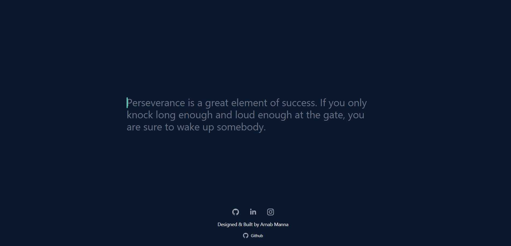

  

# Typing Website

Welcome to the Typing Website – a platform designed to improve your typing skills using Next.js, Tailwind CSS, and TypeScript.

## 🚀 Features

- ✏️ **Typing Exercises**: Engage in a variety of typing exercises to enhance your accuracy and speed.
- 📈 **Progress Tracking**: Keep track of your typing progress and set personal goals.
- 🌐 **Community**: Join our community to share tips, challenges, and achievements.
- 📱 **Responsive Design**: Enjoy a seamless typing experience on all devices.
- 🌐 **API Integration**: Access our API to retrieve exercises and track user data.

## 🛠️ Technologies Used

- [Next.js](https://nextjs.org/): A React framework for building fast and scalable web applications.
- [Tailwind CSS](https://tailwindcss.com/): A utility-first CSS framework for styling your website.
- [TypeScript](https://www.typescriptlang.org/): A typed superset of JavaScript for improved code quality.
- [API](#): Our custom API for fetching exercises and managing user data.

## 🏁 Getting Started

1. Clone this repository: `git clone https://github.com/yourusername/typing-website.git`
2. Install dependencies: `npm install`
3. Start the development server: `npm run dev`
4. Visit `http://localhost:3000` in your browser.

## 📡 API Integration

To use our API, please contact us at [api@typingwebsite.com](mailto:api@typingwebsite.com) for an API key and documentation.

## 🤝 Contributing

We welcome contributions! If you'd like to improve this project, please follow our [Contributing Guidelines](CONTRIBUTING.md).

## 📄 License

This project is licensed under the MIT License - see the [LICENSE](LICENSE) file for details.

## 📧 Contact

- Website: [https://typing-school.vercel.app/](https://typing-school.vercel.app/)
- Email: [arnabmanna203@gmail.com](arnabmanna203@gmail.com)

Happy typing! 🚀
